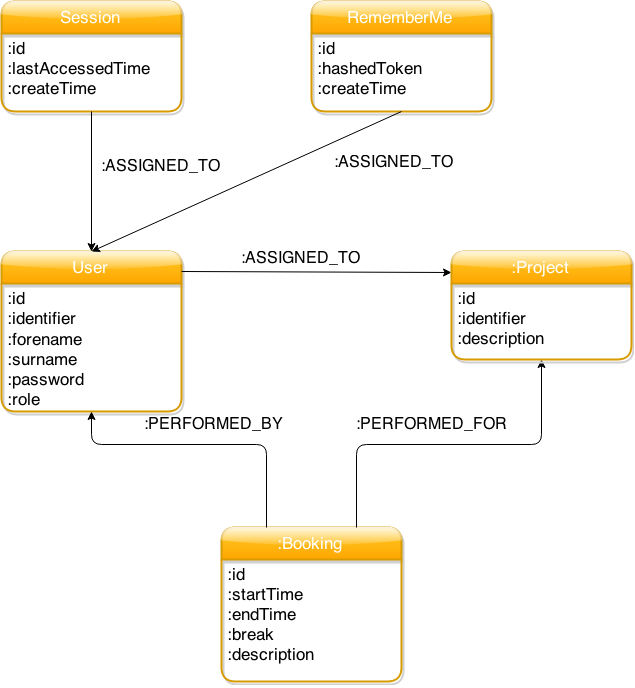

# Architecture

This chapter describes the architecture and some important architecture decisions.

## Which technologies are used?

* Java 8
* JavaEE 7 
* Arquillian
* JaCoCo
* JavaScript
* Bootstrap + JQuery
* AngularJS
* Neo4J
* Apache
* WildFly

## Architectural overview

The implementation of Eternity consists of a server part with a rest interface and an AngularJS web client which 
interacts with the server via REST calls and a websocket connection for server push.

picture

### How does the security work?

## Database nodes

There are five nodes:
* User - a concrete user which can log in the system
* Project - a project users can book time for
* Booking - a concrete booking of an user for a project
* Session - a session for a logged in user
* RememberMe - a remember me token for a user

